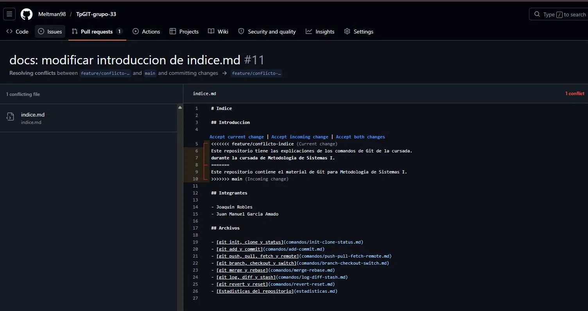

# Estadisticas del repositorio

## Integrante con mas commits

Comando: git shortlog -sn --no-merges

Resultado: Joaquin Robles con 19 commits
-Garcia Amado con 8 commits

## Cantidad total de merges

Comando: git log --oneline --merges | wc -l

Resultado: 13 merges

## Cantidad de conflictos producidos

Comando: git log --oneline --merges --grep="Merge branch" (revision manual)

Resultado: 1 conflicto (resuelto en PR #11 feature/conflicto-indice)

## Cantidad de ramas existentes

Comando: git branch -a | wc -l

Resultado: 24 ramas

## Commit con mas archivos modificados

Comando: git log --oneline --stat | grep -E "files? changed" | sort -rn | head -1

Resultado: 3 archivos modificados, 147 inserciones

## Hash de Commit de conflicto

Hash del commit: e1a1272

